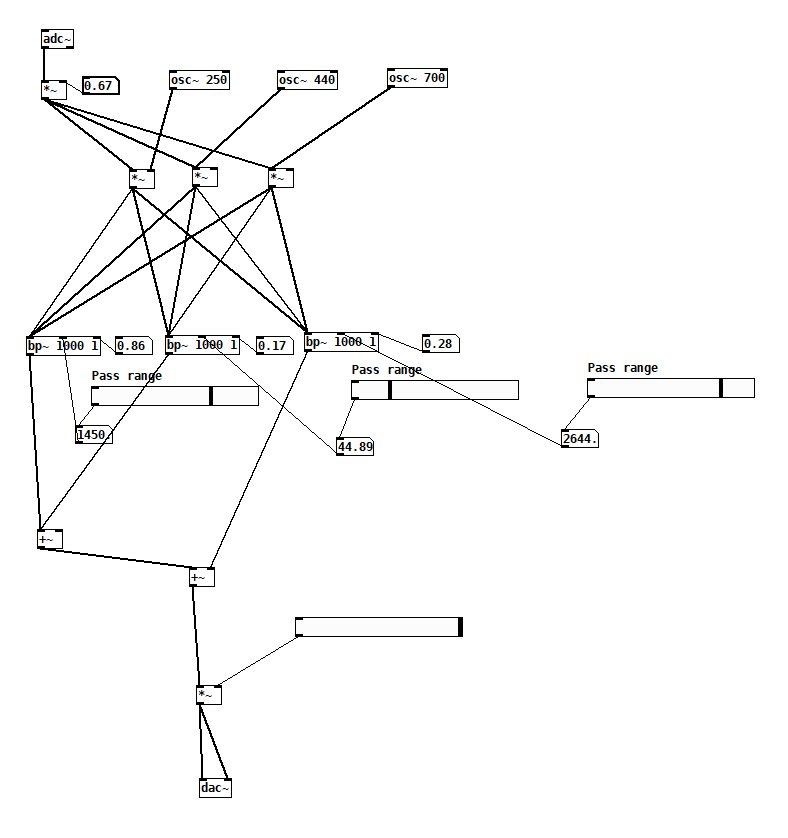

# Robotic Voice Manipulation

This is a fun little project that I did to manipulate my voice to sound robotic using Pure Data, inspired by the concept of a vocoder. The audio input from `adc~` is modulated by three oscillators, which multiply the input signal, creating a more complex sound. The modulated signal is then passed through bandpass filters to isolate specific frequency bands. After filtering, the signals are summed together to form the final output. The volume is adjusted by multiplying the sum of the signals by a control value, and the final processed signal is sent to the `dac~` object, allowing it to be heard through the speakers.

## Instructions

1. Download and install Pure Data from [here](https://puredata.info/downloads).
2. Open the `robotic_voice_manipulation.pd` file in Pure Data.
3. Adjust the bps filter pass ranges, the sliders, and the numeric values according to your liking.
4. Click on the `DSP` button to start the audio processing.
5. Speak into the microphone to hear your voice manipulated to sound robotic.

## Screenshots

